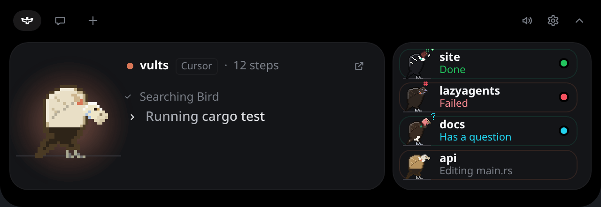
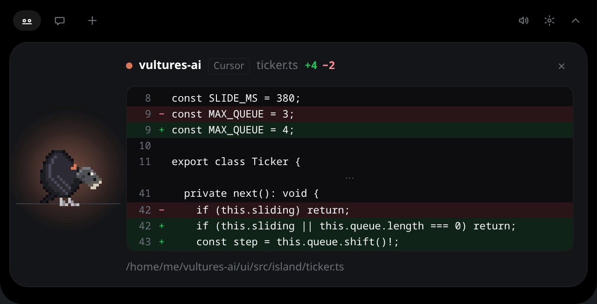

  

<h1 align="center">Vults</h1>

  <strong>Your coding agents, alive on your desktop. And a vulture who helps.</strong>

  
  
  
  
  
  

<b>English</b> · <a href="README.pt-br.md">Português</a>
 <!-- check-english:allow (language name) -->

  

Vults is a desktop app for people who run several coding agents at once. It has two parts:
the flock is the tool, and Zeca is the companion on top of it.

- **The flock.** Every Claude Code, Codex, Gemini CLI, Antigravity, OpenCode or Qwen Code session becomes an 8-bit vulture on your
  desktop, a vult, doing what its session does. You see at a glance who is working, who finished,
  who failed and who needs you; you approve, answer and jump to the right terminal without
  hunting for it. The flock lives on an island at the top of the screen, or by the panel; the tray,
  a corner widget and desktop notifications let you choose how present it is.
- **Zeca, the companion.** A black vulture who chats with you through the CLIs you already use,
  listens when you hold a key and speak, takes the files you drop on him, and over time becomes a
  personal agent that can act for you, always asking before anything runs. He is optional: one
  switch turns him off and keeps only the flock.

> **Status: 0.1, early.** Linux first (KDE Plasma and other layer-shell compositors); Windows and
> macOS later. Download the `.deb` or `.rpm` from the
> [latest release](https://github.com/rogeriojunior31/Vults/releases/latest), build the Arch
> package with `makepkg`, or build from source: see [Getting started](docs/getting-started.md).

  

## What it does

**The flock**

- **A bird per session.** It reads, pecks the wire while editing, tugs at it while a command runs,
  flies off when the agent goes to the web, and spreads its wings when a permission waits for you.
- **Approvals in one place.** The card shows the whole command, file or diff; **Allow**, **Deny**, or
  **Ctrl+Alt+Y** / **Ctrl+Alt+N** from any window. Nothing is approved without you, except what
  you allowed yourself with **Always**, for that exact command in that project.
- **Live diffs.** Each edit shows its lines added and removed; a click shows the diff.
- **Jump to the terminal.** One click focuses the session's tmux, kitty, wezterm or herdr pane, and on
  KDE Plasma or any X11 desktop raises its window (a terminal, VS Code or Cursor).
- **News from GitHub.** Failed checks, approvals and review requests, through the `gh` you already use.
- **Plan usage at a glance.** How much of your Claude and Codex limits you have spent, from the CLIs.

**Zeca**

- **Chat.** Through the `claude` or `codex` CLI you are logged into (every command and edit asks
  first), or an API key, or a local model with Ollama or LM Studio. Drop files on him.
- **Voice.** Hold **Ctrl+Alt+V** and speak: whisper.cpp transcribes it on your computer, and you
  read the text before it is sent.
- **Now playing**, if you want it: the song on the island, and the flock dances to it.

  
  

## Safe by design

The hook never blocks your agent: if the app is closed or slow, it exits at once and the agent asks in
its terminal. Agent configs change only after a dated backup and a diff you approve, and other tools'
hooks are kept. Secrets live only in the OS keyring, and there is no telemetry. See
[Safety](docs/safety.md).

## Where it is going

The first release is **0.1.0**. After it, small releases (0.1.1, 0.1.2…) come out as each piece
is ready, Linux first, until **0.2.0**:

- **Already in**: the tray, a corner widget, desktop notifications, presence modes from *Island*
  to *Paused*, quick actions on each bird, waiting cards that call louder over time, a summary
  of what happened while you were away, and voice that knows when you stop talking.
- **Control**: a command palette; a voice dictionary for the words you use; Zeca answering out
  loud through a realtime voice model, if you turn it on.
- **Platform**: local history, your projects with their branch, pull request and checks, cost per
  session.
- **0.2.0, Operations**: the full app, policies you write and approve, starting agents from here.

Zeca stays optional all the way: the flock works without him. Why we chose this, and what we
will not do, is in the [decision records](docs/adr/README.md).

## Documentation

Read it online at [rogeriojunior31.github.io/en/docs/vults](https://rogeriojunior31.github.io/en/docs/vults/),
updated on each release, or here:

- [Getting started](docs/getting-started.md)
- [The island](docs/guide/island.md) · [Approvals](docs/guide/approvals.md) · [Chat](docs/guide/chat.md) · [Connectors](docs/guide/connectors.md) · [Other agents](docs/guide/other-agents.md)
- [Settings and files](docs/reference/settings.md) · [Hook protocol](docs/reference/protocol.md)
- [Architecture](docs/architecture.md) · [Decisions](docs/adr/README.md) · [Animations](docs/ANIMATIONS.md) · [Adding a connector](docs/contributing/connectors.md)

Built with Rust and Tauri. Not to be confused with *Vulture*, the Python dead-code finder.

## Contributing

Bug reports, agents, connectors and docs fixes are welcome: see [CONTRIBUTING.md](CONTRIBUTING.md)
and the [Code of Conduct](CODE_OF_CONDUCT.md). Security issues go privately, as in
[SECURITY.md](SECURITY.md). What changed in each release is in the [changelog](CHANGELOG.md).

## License

MIT, see [LICENSE](LICENSE). Third-party attributions in [NOTICE](NOTICE).
