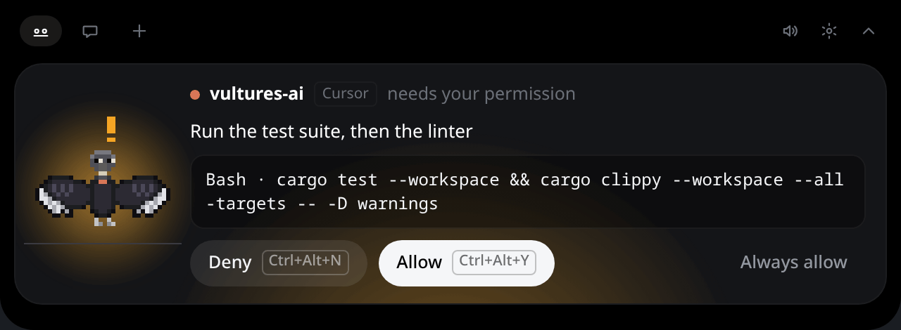
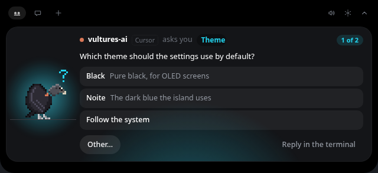

# Approving from the island

When Claude Code or Codex asks permission for a tool call, the island opens on a card that shows
exactly what **Allow** authorizes (Gemini CLI is the exception, [below](#gemini-cli)):

- the agent's own words for it, when it gives them (*Run the test suite, then the linter*);
- the whole command, the file or the URL, not just the tool's name. A long command shows in full
  (up to four lines, then it scrolls);
- for an edit, the lines it adds and removes (**+12 −3**). Patches from Codex show their files and
  counts too.

The card takes the whole width of the island until you answer. Then it says what happened for a
moment (**Allowed** in green, **Denied** in red) before the next thing shows.

## Answering

- **Allow** and **Deny** answer the agent directly; it carries on at once.
- **Ctrl+Alt+Y** and **Ctrl+Alt+N** do the same from anywhere, without leaving the window you are in.
  They are global shortcuts through the desktop portal: KDE asks you once to accept them, and you can
  change the keys in **System Settings → Shortcuts**. The buttons show the keys actually bound. A
  shortcut only answers a card that is on screen (an agent's, or one in the chat); with nothing
  waiting, it does nothing.
- A card still waiting after 20 seconds (at once in *Panel* mode) also shows as a desktop
  notification. Its **Open** brings the island up on the card; it has no Allow or Deny
  ([notifications](island.md#desktop-notifications)).
- While the app is *Paused* ([presence](island.md#presence-how-much-it-shows)) no card is shown:
  the agent asks in its terminal at once, and *Always* rules answer nothing.
- **Always allow** allows the request and every identical one from then on: the same agent, the same
  tool and the exact same command, file or URL, in the same project folder. `cargo test` does not
  cover `cargo test && rm -rf build`, nor the same command in another project. Those requests are
  answered at once, without a card, and the step says *always allowed* on the island. An identical
  request already waiting is answered too. **Settings → Approvals** lists every rule, and **Remove**
  takes one away. A command of more than one line, or longer than the card's first line shows
  (300 characters), offers no **Always allow**: a rule would only see its start.
- Only you answer: with a click or a shortcut now, or with **Always allow** earlier. No timer or
  default ever approves anything.

## More than one at a time

Requests wait in line, each for its own agent. The card shows the first one with **1 of 3**; the
sessions waiting behind it say *Needs you* in the flock list, with an amber badge. Answer one and the
next comes up.

To answer one further back first, click **Open** on its session's notification, or its bird in the
corner widget: its card comes to the front of the line. Only the order changes: each card
keeps its own deadline, and only a click on it answers it. A question card you had started
answering starts over when another card is brought in front of it. A card whose agent has moved on
(only a subagent of it still works) is not brought forward: it would not be shown.

A project you muted or hid ([per project](island.md#per-project-mute-pin-hide)) still gets its
cards, with their sound and notification as any other; hidden, its session shows with the card and
leaves again once it is answered.

A subagent working in parallel does not take a card away: only the agent that asked moving on does.
When one agent asks for two calls at once, answering the first leaves the second card waiting: the
first call finishing says nothing about the other.

## When nobody answers

A request waits as long as its agent does (a little under two minutes); meanwhile the terminal says
*Waiting for your answer on the island*. During the last 30 seconds
the card counts down, *Goes back to the terminal in 0:25*, and then the terminal asks as if Vults
were not there. If you answer in the terminal instead, the card says so and goes away.

While it waits, a card climbs a ladder, so a card you missed reaches you:

1. It opens the island, with its sound.
2. At 20 seconds, a desktop notification (at once by the panel), if notifications are on.
3. At 45 seconds, and every 30 seconds after, its sound plays again: at 45, 75 and 105 seconds.

**Do not disturb** (**Settings → General**, for 30 minutes, 1 hour or 4 hours) silences the
sounds and the notifications of everything at rest, and this ladder's reminders, until it ends by
itself (by the clock: a suspend does not stretch it); a moon in the island's header says it is
on, and a click on it ends it. A card still opens the island with its sound and its notification:
nothing hides or quiets a card an agent is waiting on.

## Auto mode and questions

- In auto mode, the classifier clears most permission requests in a blink: the island only shows a
  card, plays a sound or opens for a request still waiting after a moment, so it does not blink on
  every tool call. The same goes for "finished": only a session that stays done is news.

## Questions

When Claude Code asks you something with choices (its `AskUserQuestion` tool), the island opens on a
question card instead of a permission card:

- One question at a time, with its tag (**Theme**) and **1 of 2** when it asks several at once.
- A click on a choice answers it. When several may be picked, tick them and press **Next** (or
  **Send** on the last one).
- **Other…** opens a field for your own words; **Enter** sends it, **Escape** goes back to the
  choices.
- **Reply in the terminal** puts the question back in Claude Code's terminal, where you answer as
  usual.

Claude Code waits for the island while the card is up, so the question shows in the terminal only
after you choose **Reply in the terminal**, or once the card runs out of time (the same countdown as
a permission). **Ctrl+Alt+Y** and **Ctrl+Alt+N** never answer a question: it needs your choice.

This needs Claude Code 2.1.85 or later and hooks installed by this version. Hooks from an older
version show **Update available** in **Settings → Agents**; until you update them, the island shows
the question and takes you to the terminal, as it does for Codex and Gemini.

If the app is closed or not responding, the hook answers nothing within milliseconds and every agent
asks in its terminal as usual.

## Gemini CLI

Gemini's hooks can block a tool but not approve one: its own confirmation always runs. So a Gemini
session never gets a card. When Gemini asks, its bird shows a question (*Run rm -rf dist? Answer in
Gemini's terminal.*) and you answer there. Everything else, the steps, the flock, jumping to the
terminal, works as for the other agents.

## Antigravity

Antigravity asks its permissions in its own terminal, and the island never answers them: its bird
shows the steps, and you approve where Antigravity asks. See
[Other agents](other-agents.md#antigravity).
