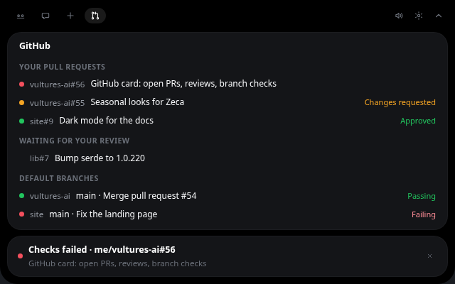

# Connectors

Connectors put news from outside services on the island. Each one is off until you switch it on in
**Settings → Connectors**.

## GitHub

Every five minutes it checks, and every minute while CI checks are still running:

- your open pull requests: checks failed or passed, approved, changes requested. A push whose
  checks already finished when the next check runs still gets its alert;
- pull requests where your review is requested;
- the checks on the default branch of your ten most recently pushed repositories.

It uses the GitHub CLI you are already logged into (`gh auth login`), so Vultures AI never sees a token.
Opening the island checks again right away when the last check is more than a minute old, so it also
retries soon after an error you fixed (say, after `gh auth login`); only a GitHub rate limit is
always waited out. The first check only learns how things are; alerts start with the next change.
Click an alert to open it on GitHub, × to dismiss it.

An alert stays only while it is the latest word on its story: checks that pass replace the failure
on the same pull request or default branch, and a newer review decision replaces the older one. A review
requested again after it was withdrawn alerts again. When GitHub cannot answer for one organization
or repository (say, one that needs SAML sign-in), the rest still shows.

### The GitHub card

Once GitHub has answered, the open island has a GitHub tab beside Flock, Chat and Drop. It shows
what is open right now:

- **Your pull requests**, most recently updated first: a dot for the checks (green passing, amber
  running, red failing, none without checks) and the review at the end (*Approved* or *Changes
  requested*);
- **Waiting for your review**: the pull requests where your review is requested;
- **Default branches**, most recently pushed first: the latest commit on the default branch of your
  recent repositories, with how its checks went. Repositories without checks are left out.

Click a row to open it on GitHub. Opening the card checks again when the last check is more than
a minute old, as opening the island does. When a pull request leaves the card (merged or closed), or
a review request is withdrawn, its alerts go with it. Switching GitHub off takes the card away.

When a check fails (GitHub down, `gh` signed out), the card keeps what it last saw and says so next
to its name: when it last updated, and the error. While a permission card waits, the GitHub tab is
dimmed: the permission comes first, and the tab works again once it is answered.

What the last check saw is kept on disk, in `connectors/github.json` in the app's data folder
(`~/.local/share/vultures-ai/` on Linux), so a restart does not alert again about old news. It holds
the titles, links and check states the card shows, nothing else.

Want another service? See [Adding a connector](../contributing/connectors.md).
