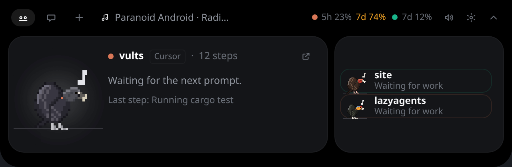

# The island

The island hangs from the top edge of your screen. On KDE Plasma, Hyprland, Sway and other compositors
with layer-shell it sits above every window like a panel; on GNOME it is a regular always-on-top window.
On X11 it shows on every workspace and never takes the keyboard, except while you type in the chat.

With more than one screen, the desktop picks one (usually the focused screen at start). To pin the
island to a screen, choose it in **Settings → General → Screen**. If that screen is unplugged or turned
off, the island moves to another one and goes back when it returns.

## The flock

Each agent session is a vulture: the black vulture, or another of Brazil's vultures (the turkey
vulture, the two yellow-headed vultures; a project with three or more sessions gets a king vulture).
A session keeps its bird while it lives; the flock changes each time the app starts. **Settings →
Flock** widens the flock to the vultures of the Americas or of the whole world, and picks Zeca's
species. **Zeca**, a black vulture unless you pick another, stands for the session in front: the one
that needs you, the one you clicked, an active session, or else the one that arrived first (birds
keep their places on the wire, so the flock does not shuffle with every event). Every other session
is a **vult**. A small band at the base of each neck shows the agent: orange for Claude Code, teal
for Codex, blue for Gemini CLI.

The birds do what their sessions do: Zeca lowers his head to read, pecks the wire while editing, tugs
at it while a command runs, takes off and circles when the agent goes to the web, and spreads his
wings when a permission waits for you. New sessions fly in and land; sessions that end fly off. Waiting
for work, they take off after two seconds idle and circle together below the island. A session that
finished its turn plays its done clip first, then joins them six seconds after its done state shows;
its badge stays until you dismiss it. The flock keeps
circling while the island is open, and stays up as long as those sessions are idle. When a session
starts working, only its bird returns to its perch; the others keep circling. With no manual selection,
an active session takes the focus card. Permissions keep their priority, and unacknowledged outcomes
stay visible. Reduced motion keeps
the birds on their perches. These are the actual sessions, not extra decorative birds.
See [Animations](../ANIMATIONS.md) for every clip and the
behavior it comes from.

## Compact, open and hidden

**Compact**, the island is a small pill of fixed size: Zeca on the left with the session in front,
its project and what it is doing (in color when it needs you: amber for a permission, cyan for a
question, green when done, red when it failed), and up to four vults on the right. A vult whose
session finished, failed, asks something or waits for a permission wears a badge of that color.
Connector news shows as *2 new*.

**Click** the pill to open the island. It stays open while the pointer is on it, and folds back
15 seconds after the pointer leaves; a thin line at the bottom shrinks during the last seconds, and
coming back cancels it. The **Fold** button (the chevron at the top right) folds it at once.
**Settings → General → Fold the island** sets the wait (5, 10, 15, 30 or 60 seconds).

Two things keep it open until you are done:

- **a permission card.** It opens the island by itself and stays until you answer; nothing else
  opens it by itself. A session that finishes, fails or asks something plays its sound and gets
  its badge instead.
- **the chat.** It has the keyboard, so the island never folds while you type.

With nobody on the wire for a minute, the island **hides**. Move the pointer to the middle of the top
edge of the screen and it comes back.

## The open island

Open, the island has three tabs, as icons (their names show on hover): **Flock**, **Chat**, and
**Drop a file**, which opens the chat on a drop zone saying how to hand Zeca a file. On the right: a
sound toggle, the settings button and **Fold**. Below them, side by side:

- **the focus card**: Zeca, large, on his piece of wire, with a glow in the color of the session's
  state and a mark over his head for it (a thought bubble, an amber `!` for a permission, a cyan `?`,
  green sparkles when done, a red `#` when it failed, sweat at a usage limit), and that session's
  card beside him;
- **the flock list**: one row per other session, with its bird, its project, what it is doing (or
  its state, in color) and its badge. More than four rows scroll. With a single session the card
  takes the whole width.

| Session | Card |
|---|---|
| Working | Its project, the agent, how many steps so far and its running subagents, then the step ticker: the step just done, and the current one |
| Idle | *Waiting for the next prompt*, and the last step |
| Needs permission | The exact command, file or URL, with **Deny** and **Allow** |
| Has a question | The question itself, and **Open terminal** to answer it |
| Finished | The agent's last reply, **OK** and **Open terminal** |
| Failed | The error, **OK** and **Open terminal** |

A step reads like *Editing main.rs* or *Running cargo build*. A test suite says *Testing cargo test*, and
a tool from an MCP server names the server and the tool: *Calling github · list_prs*.

**OK** says you have seen it: the badge goes and the card shows the session as idle, until it starts
working again. When the card or the session in front changes, the old card fades out as the new one
fades in.

With nobody on the wire, the card says so and offers **Ask Zeca**.

Zeca notices you: he looks toward the pointer, turns to you when it is on him, preens if you leave it
there, startles at a click, and gets cross at three. When the app starts he lands on his wire and
says hello before the island folds: by your first name when your account has a full name (taken
from your user account, never from the network; a login name like `jdoe42` is not used). The chat
knows it too.

## Now playing

Turn on **Settings → General → Now playing** and the island shows the song your music player is
playing (Spotify, a browser tab, mpv: any player that speaks MPRIS). With nothing running, the
compact island says *♪ Song · Artist*; the open island shows it in the top bar, with previous,
play/pause and next when the pointer is on it. While the music plays, idle birds dance to it.

## Subscription usage

The open island's top bar shows how much of your plans' limits you have used, each next to its
agent's dot: *7d 12%* is 12% of the weekly window. Each window goes by its length (*5h*, *7d*),
since plans differ: some only have a weekly one. It turns amber at 70% and red at 90%, and
pointing at it tells when it resets. No token of yours is ever read: each number comes from the
CLI you logged into.

- **Codex**: asked every 5 minutes, read-only (nothing is spent).
- **Claude Code** (Pro or Max): it reports usage only to a status line, so installing the hooks
  also adds one of ours, which shows nothing in Claude Code. The numbers arrive after a session's
  first reply. If you already have a status line of your own, it is left as it is, and the island
  shows no Claude Code usage (**Settings → Agents** says so).

## Getting to a session

Click a row in the flock list to put that session in front. Click **Open terminal** on its card to
bring its terminal forward: the multiplexer pane first (herdr, tmux, kitty, wezterm), then, on KDE,
the terminal window itself. When there is nothing to bring forward (a terminal outside any of them,
on another desktop), the card says so.

A session started in the terminal of VS Code or Cursor carries a small **VS Code** or **Cursor**
tag next to its project, and its button reads **Open in VS Code** or **Open in Cursor**: on KDE it
raises that editor's window.

## Sounds

Short 8-bit blips when a session needs you, finishes or fails, and for connector news; softer ones
when the island opens, folds or comes out of hiding, and when Zeca reacts to you. The speaker button
on the island, or **Settings → General → Sounds**, turns them off.
