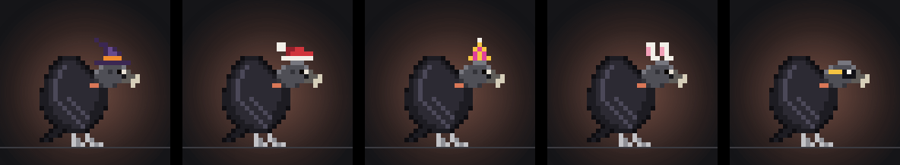

# A ilha
<!-- source: 55966c5c2346 -->

A ilha fica pendurada na borda de cima da tela. No KDE Plasma, Hyprland, Sway e outros compositores
com layer-shell, ela fica acima de todas as janelas, como um painel; no GNOME, é uma janela comum
sempre no topo. No X11, ela aparece em todas as áreas de trabalho e nunca pega o teclado, exceto
enquanto você digita no chat.

Com mais de uma tela, o desktop escolhe uma (em geral, a tela em foco na inicialização). Para fixar a
ilha numa tela, escolha-a em **Settings → General → Screen**. Se essa tela for desconectada ou
desligada, a ilha passa para outra e volta quando ela retornar.

## O bando

Cada sessão de agente é um urubu: o urubu-de-cabeça-preta, ou outro dos urubus do Brasil (o
urubu-de-cabeça-vermelha, os dois urubus-de-cabeça-amarela; um projeto com três ou mais sessões
ganha um urubu-rei). Uma sessão mantém sua ave enquanto existir; o bando muda a cada vez que o app
inicia. **Settings → Flock** amplia o bando para os urubus das Américas ou do mundo todo, e escolhe
a espécie do Zeca. O **Zeca**, um urubu-de-cabeça-preta a menos que você escolha outro, não é uma
sessão: ele fica no fio quando nada roda e é com quem você fala no chat. A sessão da frente (a que
precisa de você, a que você clicou ou, senão, a que chegou primeiro) ocupa o lugar dele com a
própria ave; o trabalho sozinho nunca a muda, então as aves mantêm espécie e lugar e o bando não se
embaralha a cada evento. Toda outra sessão é um **vult**. Uma pequena faixa na base de cada pescoço mostra o agente: laranja para
Claude Code, verde-azulado para Codex, azul para Gemini CLI.

As aves fazem o que suas sessões fazem: o Zeca abaixa a cabeça para ler, bica o fio enquanto edita,
puxa o fio enquanto um comando roda, levanta voo e circula quando o agente vai à web, e abre as asas
quando uma permissão espera por você. Sessões novas chegam voando e pousam; sessões que terminam vão
embora voando. Cada subagente em execução manda um batedor (um urubu-de-cabeça-vermelha ou
de-cabeça-amarela) para circular baixo ao lado da ave da sua sessão na ilha aberta. De vez em quando
um visitante raro (um condor, um grifo) pega a térmica uma vez e segue seu caminho; **Settings →
Flock** desliga os visitantes. Esperando trabalho, elas levantam voo depois de dois segundos ociosas
e circulam juntas abaixo da ilha. Uma sessão que terminou seu turno toca primeiro seu clipe de
concluído, depois a assinatura da sua espécie, e se junta a elas quando os dois acabam; seu selo fica
até você dispensá-lo. O bando continua circulando enquanto a ilha está aberta, e fica no ar enquanto
essas sessões estiverem ociosas. Quando uma sessão começa a trabalhar, só a ave dela volta ao
poleiro; as outras continuam circulando. As permissões mantêm sua prioridade, e resultados não confirmados continuam visíveis. Com
movimento reduzido, as aves ficam nos poleiros. Essas são as sessões reais, não aves decorativas
extras. Veja [Animações](../ANIMATIONS.md) para cada clipe e o comportamento de onde ele vem.

### Os visuais sazonais do Zeca

O Zeca se arruma para a estação: um chapéu de bruxa de 1º de outubro a 1º de novembro, um gorro de
Papai Noel de 1º a 26 de dezembro, um chapéu de festa da véspera de Ano-Novo a 2 de janeiro, e
orelhas de coelho da Sexta-feira Santa à segunda-feira depois da Páscoa. Os dias seguem a data e o
fuso horário do seu computador. **Settings → Flock → Look** deixa ele com um visual o ano todo (os
óculos escuros só estão ali, já que nenhum verão serve para os dois hemisférios), ou com nenhum. A
mesma lista tem catorze trajes sem estação: bandanas, bonés e chapéus, óculos escuros, um durag ou
dreads com um grill de ouro, uma coroa, fones de ouvido, um tapa-olho, e correntes com um medalhão,
uma cruz, um relógio ou uma placa cromada pendurados na faixa. Só o Zeca usa; os vults ficam com
suas penas.

**Clique com o botão direito no Zeca** na ilha (no poleiro dele, ou no lugar dele na pílula
recolhida) para a mesma escolha ali mesmo: os visuais em três grupos (*Seasonal*, *Head*, *With a
chain*), com *Auto* e *None* no topo. O Zeca veste o que estiver sob o ponteiro, então você vê nele
antes de escolher; um clique escolhe (as Settings acompanham), e Escape ou o botão de fechar deixam
ele como estava. Um card que precisa de você toma o lugar da ilha, como sempre.

### Sem o Zeca

O Zeca é opcional. **Settings → Flock → Zeca** desliga ele; tudo no bando continua funcionando:
sessões no fio, cards de permissão e de pergunta, os atalhos de Allow / Deny, notificações,
conectores e as predefinições. O que vai embora com ele:

- O chat, a aba dele e a aba de soltar arquivos, o *Chat…* da bandeja, o microfone e o atalho de
  fala (nenhum chat começa e o microfone fica fechado; o servidor de uma conversa do Codex é
  encerrado). Os medidores de uso ficam: eles leem as assinaturas dos seus agentes.
- O olá dele na inicialização.
- O lugar dele no fio: a sessão da frente fica ali como sua própria ave, e sem nada rodando a pílula
  mostra *Nothing running* sobre um fio vazio.

Ligue ele de volta no mesmo lugar; sem reiniciar em nenhum dos dois casos.

## Compacta, aberta e escondida

**Compacta**, a ilha é uma pequena pílula de tamanho fixo: o Zeca à esquerda com a sessão da frente,
o projeto dela e o que ela está fazendo (em cor quando precisa de você: âmbar para uma permissão,
ciano para uma pergunta, verde quando concluiu, vermelho quando falhou), e até quatro vults à
direita. Um vult cuja sessão terminou, falhou, pergunta algo ou espera uma permissão usa um selo
dessa cor. Novidades de conectores aparecem como *2 new*.

**Clique** na pílula para abrir a ilha. Ela fica aberta enquanto o ponteiro está sobre ela, e se
recolhe 15 segundos depois que o ponteiro sai; uma linha fina embaixo encolhe durante os últimos
segundos, e voltar com o ponteiro cancela. O botão **Fold** (a seta no canto superior direito)
recolhe na hora. **Settings → General → Fold the island** define a espera (5, 10, 15, 30 ou 60
segundos).

Com **Settings → General → Open on hover** ligado, deixar o ponteiro parado sobre a pílula (ou na
borda de cima, onde a ilha escondida acorda) abre a ilha, sem clique; só passar por cima não abre
nada. Aberta assim, ela se recolhe assim que o ponteiro sai, a não ser que você tenha clicado nela:
aí ela espera como qualquer ilha aberta. Desligado por padrão, e não vale no *Panel*.

Duas coisas a mantêm aberta até você terminar:

- **um card de permissão.** Ele abre a ilha sozinho e fica até você responder; nada mais a abre
  sozinho. Uma sessão que termina, falha ou pergunta algo toca seu som e ganha seu selo em vez
  disso.
- **o chat.** Ele tem o teclado, então a ilha nunca se recolhe enquanto você digita.

Sem ninguém no fio por um minuto, a ilha **se esconde**. Leve o ponteiro ao meio da borda de cima da
tela e ela volta.

## Presença: quanto ela mostra

**Settings → General → Presence**, ou o menu da bandeja, escolhe uma de quatro predefinições. A
mudança é imediata, sem reiniciar.

| Predefinição | Em repouso | Um card que precisa de você |
|---|---|---|
| *Island* (o padrão) | O bando no topo da tela, como descrito acima | Abre a ilha, com seu som |
| *Panel* | Nada no topo; o Zeca na bandeja (abaixo) | Abre a ilha junto ao painel, com seu som |
| *Quiet* | Nada: sem bando, sem som quando uma sessão termina ou falha, nenhum para novidades de conectores. A faixa no topo da tela ainda traz a ilha de volta | Abre a ilha no topo, com seu som |
| *Paused* | Uma pílula que diz *Paused*, nada mais | Nenhum: o agente pergunta no terminal na hora, como se o app estivesse fechado |

Em toda predefinição menos *Paused*, um card sempre abre a ilha e espera seu clique ali: nenhuma
predefinição esconde um card pelo qual um agente está esperando. *Paused* é para quando você não
quer interrupção nenhuma:

- Uma permissão ou uma pergunta vai direto para o terminal do agente; o agente não espera pelo app.
  Cards que já esperavam quando você pausa também vão para seus terminais. Regras que você criou
  com *Always* não respondem nada enquanto está pausado.
- Os conectores param de checar (continuam ligados nas Settings e voltam quando você escolhe outra
  predefinição).
- Sem notificações do desktop.
- O Zeca na bandeja ainda mostra o bando, de asas abertas quando um agente espera no terminal.

Escolha outra predefinição para voltar; a ilha mostra o bando de novo na hora.

### No painel

- Nada é desenhado no topo da tela. O Zeca fica na bandeja do painel e mostra o que o bando está
  fazendo: empoleirado (nada acontecendo), trabalhando, de asas abertas com uma marca âmbar (uma
  permissão ou uma pergunta espera por você), brilhos verdes (concluído), uma marca vermelha
  (falhou). Ele se move devagar, um ou dois quadros por segundo, e fica parado quando as animações
  do desktop estão desligadas.
- **Clique** nele e a ilha abre no canto do painel, ao lado da bandeja. Ela se recolhe como de
  costume quando o ponteiro sai, ou com o botão **Fold** ou Escape, e na hora quando você vai às
  Settings, então nunca cobre o canto dessa janela (um card esperando ou um chat aberto a mantém).
  Mudar para *Panel* também recolhe uma ilha aberta. **Clique com o botão direito** nele para o menu
  (*Chat…*, *Set up agents…*, as quatro predefinições, *Quit*).
- **Um card abre a ilha sozinho**, junto ao painel, com seu som, e o Zeca chama atenção na bandeja
  até você responder. A bandeja só mostra: Allow e Deny são sempre cliques no card.

No KDE Plasma, o canto segue o painel que tem a bandeja do sistema: com um painel embaixo (o padrão
do Plasma) a ilha abre no canto inferior direito, com um painel em cima no canto superior direito,
com um painel lateral na parte de baixo desse lado. Em outros desktops ela abre no canto inferior
direito. A bandeja precisa de um painel que mostre StatusNotifierItems (o Plasma mostra; no GNOME, a
extensão AppIndicator, onde um clique esquerdo pode abrir o menu em vez disso). Sem bandeja, inicie
o Vults de novo para abrir as configurações dele.

Novidades de conectores (uma checagem que falhou, uma revisão) ainda tocam seu som no modo *Panel*,
mas não abrem a ilha nem mudam o Zeca na bandeja: clique nele para ler.

Nas outras predefinições o Zeca também fica na bandeja, com os mesmos estados e o mesmo menu, e um
clique nele abre a ilha no topo.

## O widget de canto

**Settings → General → Corner widget** coloca uma pequena janela num canto da tela que você escolhe
(superior esquerdo, superior direito, inferior esquerdo ou inferior direito); ele fica desligado até
você escolher um. Ele mostra até três aves e quantas sessões estão trabalhando ou precisam de você:

- A primeira ave é a sessão da frente (a que a ilha mostra), o Zeca quando nada roda; depois, as
  sessões que mais querem você: um card esperando, uma falha, trabalho concluído.
- O texto diz quantas precisam de você (em âmbar, com uma borda âmbar em volta do widget) e quantas
  estão trabalhando; *Nothing running* com o fio vazio, *Paused* enquanto o app está pausado.
- **Clique** nele e a ilha abre, no card quando há um esperando. Clique numa ave e a sessão dela vem
  para a frente antes (não enquanto um card espera: o card fica na frente, a menos que o próprio
  card dessa ave espere atrás dele, e então esse vem primeiro). O widget nunca responde a um card:
  Allow e Deny são cliques no card na ilha.

O widget fica longe dos painéis do desktop e fica por baixo de janelas em tela cheia, como um
painel. Ele funciona com todas as predefinições, *Panel* incluída. Sem layer-shell, é uma pequena
janela sempre no topo: naquele canto no X11, onde o desktop colocar no GNOME. É mais uma web view:
cerca de 40 MiB a mais de memória enquanto está ligado, e nada quando está desligado.

## Notificações do desktop

No *Panel*, em que a ilha fica fora de vista, o Vults também avisa você pelas notificações do seu
desktop (Linux, qualquer desktop com um servidor de notificações: Plasma, GNOME, Mako, Dunst…). No
topo da tela (*Island*, *Quiet*) a ilha já mostra tudo isso, e um card a abre com o som dele: nada vai
para o desktop, então você nunca é avisado duas vezes. *Paused* também não mostra nenhuma.

- **Uma sessão terminou**, com a primeira linha da última resposta dela, ou **parou num erro**, com
  o erro.
- **Uma sessão precisa de você**: um card de permissão ou de pergunta espera. Vem na hora, com a ilha
  abrindo junto ao painel.
- **Uma sessão ficou quieta**: ela está trabalhando sem novidades há 15 minutos
  ([uma ave quieta](#a-quiet-bird)).

O que terminou ou falhou em *Paused*, ou com as notificações desligadas, não é avisado depois, quando
você retoma ou as liga de novo.

Cada sessão tem no máximo uma notificação: uma mais nova a substitui, e ela some sozinha quando o
card é respondido (aqui ou no terminal), a sessão volta a trabalhar, ou a sessão vai embora (uma ave
que terminou sai do fio depois de 10 minutos, uma silenciosa depois de 30, e a notificação dela
junto). O título é o nome do projeto. Ligar as notificações de novo, ou trocar para *Panel*,
mostra o que está acontecendo naquele momento, inclusive uma sessão que terminou; voltar para o topo
as retira.

Uma notificação tem uma ação, **Open** (ou um clique nela): a ilha aparece junto ao painel, com
aquela sessão na frente. Ela nunca tem Allow ou Deny: só um clique no card o responde.
Desligue-as em **Settings → General → Notifications**, ou por um tempo com **Do not disturb** logo
acima: o que terminar nesse meio-tempo não é avisado quando acaba.

## A ilha aberta

Aberta, a ilha tem três abas, como ícones (os nomes aparecem ao passar o ponteiro): **Flock**,
**Chat** e **Drop a file**, que abre o chat numa área de soltar dizendo como entregar um arquivo ao
Zeca. Assim que o GitHub responde, uma quarta aba mostra o card dele
([Conectores](connectors.md#the-github-card)). À direita: um botão de som, o botão de configurações
e **Fold**. As Settings abrem em **Agents** enquanto os hooks de um agente forem mais antigos que
esta versão ou nenhum estiver instalado ainda (o *Set up agents…* da bandeja sempre abre ali), e em
**General** nos outros casos. Abaixo deles, lado a lado:

- **o card de foco**: o Zeca, grande, no pedaço de fio dele, com um brilho na cor do estado da
  sessão e uma marca sobre a cabeça para ele (um balão de pensamento, um `!` âmbar para uma
  permissão, um `?` ciano, brilhos verdes quando concluiu, um `#` vermelho quando falhou, suor num
  limite de uso), e o card daquela sessão ao lado dele;
- **a lista do bando**: uma linha para cada outra sessão, com a ave dela, o projeto, o que está
  fazendo (ou o estado, em cor) e o selo. Mais de quatro linhas rolam. Com uma única sessão, o card
  ocupa toda a largura.

| Sessão | Card |
|---|---|
| Trabalhando | O projeto, o agente, quantos passos até agora e os subagentes em execução, e então o ticker de passos: o passo que acabou de ser feito, e o atual |
| Ociosa | *Waiting for the next prompt*, e o último passo |
| Precisa de permissão | O comando, arquivo ou URL exato, com **Deny** e **Allow** |
| Tem uma pergunta | A própria pergunta, e **Open terminal** para respondê-la |
| Concluída | O primeiro parágrafo da última resposta do agente numa linha, sem as marcas de markdown e as tabelas, **OK** e **Open terminal** |
| Falhou | O erro, **OK** e **Open terminal** |

Um passo aparece como *Editing main.rs* ou *Running cargo build*. Uma suíte de testes diz *Testing
cargo test*, e uma ferramenta de um servidor MCP nomeia o servidor e a ferramenta: *Calling github ·
list_prs*.

Quando uma edição termina, o passo dela mostra as linhas que adicionou e removeu (*Editing main.rs*
**+4 −2**). Clique nelas para ver o diff no lugar do card, com os números de linha do arquivo quando
o agente os enviou (o Claude Code envia; os patches do Codex e as edições do Gemini CLI não têm). Um
patch sobre vários arquivos mostra cada arquivo por vez. **×** ou **Esc** volta. Um diff só é
guardado enquanto o passo dele estiver entre os últimos oito da sessão, e no máximo 400 linhas dele;
um mais longo avisa que para antes do fim.

**OK** diz que você viu: o selo some e o card mostra a sessão como ociosa, até ela começar a
trabalhar de novo. Quando o card ou a sessão da frente muda, o card antigo some aos poucos enquanto o
novo aparece.

Sem ninguém no fio, o card diz isso e oferece **Ask Zeca**.

O Zeca percebe você: ele olha para o ponteiro, vira para você quando o ponteiro está sobre ele, se
arruma se você deixar o ponteiro ali, se assusta com um clique, e fica bravo no terceiro. Quando o
app inicia, ele pousa no fio e dá um olá antes de a ilha se recolher: pelo seu primeiro nome quando
sua conta tem um nome completo (tirado da sua conta de usuário, nunca da rede; um nome de login como
`jdoe42` não é usado). O chat também sabe.

## Tocando agora

Ligue **Settings → General → Now playing** e a ilha mostra a música que o seu player está tocando
(Spotify, uma aba do navegador, mpv: qualquer player que fale MPRIS). Sem nada rodando, a ilha
compacta diz *♪ Song · Artist*; a ilha aberta mostra na barra de cima, com anterior, tocar/pausar e
próxima quando o ponteiro está sobre ela. Enquanto a música toca, as aves ociosas dançam com ela.

## Uso da assinatura

A barra de cima da ilha aberta mostra quanto dos limites dos seus planos você já usou, cada um ao
lado do ponto do seu agente: *7d 12%* é 12% da janela semanal. Cada janela é indicada pela sua
duração (*5h*, *7d*), já que os planos variam: alguns só têm uma semanal. Ela fica âmbar em 70% e
vermelha em 90%, e apontar para ela mostra quando reinicia. Nenhum token seu é lido: cada número vem
da CLI em que você fez login.

- **Codex**: consultado a cada 5 minutos, só leitura (nada é gasto), nunca com a tela bloqueada;
  quando uma leitura falha (sem Codex, sem login), a próxima espera o dobro, até uma hora.
- **Claude Code** (Pro ou Max): ele informa o uso só para uma status line, então instalar os hooks
  também adiciona uma nossa, que não mostra nada no Claude Code. Os números chegam depois da
  primeira resposta de uma sessão. Se você já tem uma status line sua, ela continua aparecendo: a
  instalação a guarda e a nossa status line a executa (o diff diz isso), e remover os hooks a põe de
  volta.

## Chegando a uma sessão

Clique numa linha da lista do bando para pôr aquela sessão na frente. Ela fica ali até você escolher
outra ou ela ir embora; um card esperando por você ainda vem primeiro. Sem nada escolhido, a
sessão que chegou primeiro fica na frente. Clique em **Open terminal** no card dela para trazer o
terminal dela para a frente: primeiro o painel do multiplexador (herdr, tmux, kitty, wezterm),
depois a própria janela do terminal, no KDE Plasma (Wayland ou X11) e em qualquer sessão X11 (Xfce,
Cinnamon, MATE, i3…), na área de trabalho dela e fora do minimizado. Quando o terminal tem várias
janelas, vem primeiro a que tem o nome da pasta da sessão no título. No GNOME, Hyprland ou Sway sob
Wayland, só um terminal rodando pelo XWayland pode vir para a frente. O kitty é alcançado pelo socket
de controle remoto dele: defina `listen_on unix:/tmp/kitty` e `allow_remote_control socket-only` no
`kitty.conf`. Quando não há nada para trazer para a frente, o card diz isso.

De qualquer lugar, sem sair da janela em que você está:

- **Ctrl+Alt+J** põe a próxima sessão na frente e **Ctrl+Alt+K** a anterior, na ordem do bando,
  dando a volta no fim. Enquanto um card espera, ele fica na frente; as teclas escolhem quem vem
  depois dele.
- **Ctrl+Alt+Space** abre a ilha. Ela se recolhe como de costume quando o ponteiro sai.

Esses são atalhos globais pelo portal do desktop, como Allow e Deny: o KDE pede uma vez para você
aceitá-los, e você pode mudar as teclas em **System Settings → Shortcuts** (vale a pena se o seu
editor usa Ctrl+Alt+J ou K: as IDEs da JetBrains usam). **Settings → General** lista todos eles.

Uma sessão iniciada no terminal do VS Code ou do Cursor leva uma pequena etiqueta **VS Code** ou
**Cursor** ao lado do projeto, e o botão dela diz **Open in VS Code** ou **Open in Cursor**: no KDE e
em sessões X11, ele traz a janela desse editor para a frente.

### Ações rápidas

**Clique com o botão direito** num vult na pílula recolhida, numa linha da lista do bando ou no card
de foco (longe do Zeca, cujo clique direito fica com os visuais dele) para as ações rápidas daquela
sessão, no lugar do card:

- **Open terminal**, como no card, onde o app consegue trazê-lo para a frente: um painel do herdr,
  tmux, kitty ou wezterm em qualquer desktop, ou a própria janela no KDE e em sessões X11. Em
  outros lugares fica acinzentado, o menu diz que o desktop não consegue, e oferece a pasta em vez
  disso.
- **Open folder**: a pasta da sessão no VS Code quando `code` está no seu `PATH` (o item então diz
  *Open folder in VS Code*), senão no seu gerenciador de arquivos. Só uma pasta que existe, pelo
  caminho completo, é aberta, e nenhum shell é usado.
- **Activity**: cada passo que a sessão guarda (os últimos oito), numerados, com o **+N −M** de cada
  edição concluída para abrir o diff dela. **Esc** volta.
- **View the last diff**, e **Open its file in VS Code** na primeira linha alterada (sem o VS Code,
  *Show its file in the folder* abre o gerenciador de arquivos nele; um arquivo nunca é executado nem
  aberto com o que quer que lide com o tipo dele). Um patch sobre vários arquivos abre o primeiro, e
  avisa isso.
- **Keep in front**, ou *Let the flock choose* para a sessão que você pôs na frente.
- **Mute**, **Pin** ou **Hide this project**, para uma sessão com uma pasta (abaixo).

O menu nunca tem Allow ou Deny, e um card que precisa de você toma o lugar da ilha, como sempre: o
menu não abre por cima de um. Para chegar a um card esperando atrás de outro, use o **Open** da
notificação dele (no *Panel*) ou a ave dele no widget de canto: esse card vai para o começo da fila.

### Enquanto você estava fora

Quando a tela bloqueia (qualquer desktop que avise isso pelo `org.freedesktop.ScreenSaver`: Plasma,
GNOME e outros), a ilha descansa: sem animação e sem timers, e os conectores param de checar até
você voltar. Agentes e cards seguem como sempre: um card ainda abre a ilha e espera.

Quando você desbloqueia, ou escolhe outra predefinição depois de *Paused*, uma linha acima das
novidades diz o que aconteceu nesse meio-tempo, contado a partir das próprias sessões (sem modelo):
*While you were away: 2 finished, 1 failed, 1 waits for you for 12 min.* Na predefinição *Island*
ela abre a ilha uma vez, depois se recolhe como de costume (junto ao painel ou no *Quiet* ela espera
você abrir), e fica na ilha aberta até você dispensá-la com **×**. Só conta o que aconteceu enquanto
você estava fora: uma sessão que terminou nesse meio-tempo, também com as notificações desligadas ou
o não perturbe ligado, e os cards que chegaram nesse meio-tempo e ainda esperam. Se nada aconteceu,
não há linha; projetos que você escondeu ou silenciou ficam de fora.

### Uma ave quieta

Uma sessão que está *trabalhando* (uma ferramenta começou) e não manda nada por **5 minutos** pode
estar travada: um comando esperando entrada no terminal, uma ferramenta pendurada, um build longo. A
ave dela ganha um selo cinza e o status diz *No news for 5 min*. Aos **15 minutos** o selo fica
âmbar, o card diz *No news for 15 minutes.* sobre um brilho âmbar, um som de alerta toca, e no *Panel* uma
notificação do desktop diz que ela ficou quieta (a menos que as notificações estejam desligadas ou o
projeto dela esteja silenciado). Pensar (uma resposta longa) não é sinalizado, e qualquer novidade da
sessão limpa o sinal na hora.

O card tem três respostas, e nenhuma delas mexe no agente: o app só avisa.

- **Snooze**: o sinal some por 15 minutos, depois volta como estava se a sessão ainda estiver quieta,
  com seu som (e, no *Panel*, sua notificação) de novo.
- **Keep going**: está tudo bem; o sinal cinza só volta 30 minutos depois, e o âmbar 10 minutos
  depois disso.
- **Dismiss**: nenhum sinal de novo nesta execução; a próxima pergunta dela volta a vigiar.

O widget de canto e a bandeja contam uma ave quieta em alerta como algo que merece uma olhada, como
um limite de uso. Uma sessão silenciosa sai do fio depois de 30 minutos sem novidades, como sempre;
qualquer uma das três respostas conta como novidade para isso, e *Keep going* a mantém no fio até o
sinal dela poder voltar.

### Por projeto: silenciar, fixar, esconder

As sessões saem do fio em 10 a 30 minutos, então essas escolhas pertencem ao projeto (a pasta dele),
não a uma sessão: toda sessão naquela pasta as segue, agora e depois.

- **Mute**: sem sons e sem notificações do desktop quando as sessões dele terminam ou falham. Um card
  de uma delas ainda abre a ilha com seu som (e, no *Panel*, sua notificação): nada silencia um card pelo qual um
  agente está esperando.
- **Pin**: as sessões dele vêm primeiro no fio, na pílula e na lista (e as teclas de próxima e
  anterior sessão passam por elas primeiro).
- **Hide**: as sessões dele ficam fora da ilha, da bandeja e do widget de canto, e não mandam
  notificações. Um card de uma delas ainda aparece, com a sessão, até ser respondido: nada esconde um
  card pelo qual um agente está esperando.

**Settings → Projects** lista todo projeto com alguma escolha ligada, com um botão para cada uma, e
**Forget** para limpá-las; é o caminho de volta para um projeto escondido.

## Sons

Bipes curtos de 8 bits quando uma sessão precisa de você, termina ou falha, e para novidades de
conectores; outros mais suaves quando a ilha abre, se recolhe ou sai do esconderijo, e quando o Zeca
reage a você. O botão de alto-falante na ilha, ou **Settings → General → Sounds**, desliga todos.
**Volume**, logo abaixo, define o quão alto eles tocam; um som de teste toca quando você solta o
controle deslizante, e a ilha usa o novo volume na hora.

Um card que continua esperando soa de novo aos 45 segundos e a cada 30 segundos depois disso
([a escada de atenção](approvals.md#when-nobody-answers)). **Settings → General → Do not disturb**
silencia sons e notificações por 30 minutos, 1 hora ou 4 horas; uma lua aparece no cabeçalho da ilha
aberta enquanto dura, e um clique nela encerra. Um card ainda abre a ilha com seu som (e, no *Panel*,
sua notificação), mas não soa de novo.
